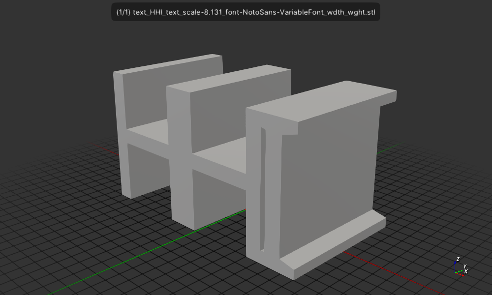
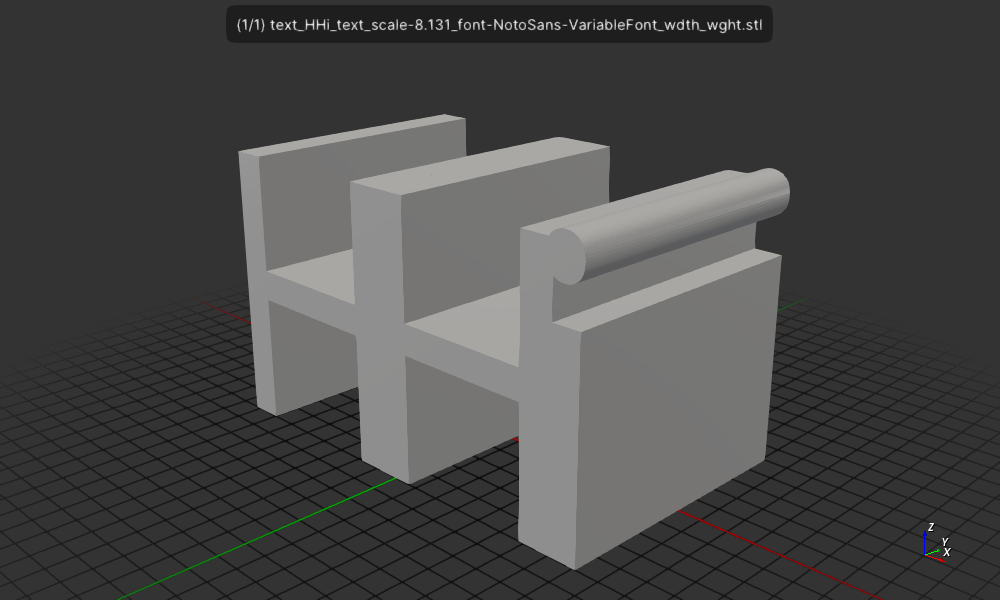

# Experiment with CSG::text

Experiment with csgrs text rendering API.

I wanted to make the text 1mm high and experimenting with the scale factor
I found for "HHI" that 8.1307502 was pretty close as you can see from the
extents Z value:
```
$ cargo run -- HHI 8.1307502 fonts/NotoSans-VariableFont_wdth_wght.ttf
   Compiling text v0.1.0 (/home/wink/data/prgs/3dprinting/text)
    Finished `dev` profile [unoptimized + debuginfo] target(s) in 1.27s
     Running `target/debug/text HHI 8.1307502 fonts/NotoSans-VariableFont_wdth_wght.ttf`
text_3d_bb.extents()=[[1.8109243797831487, 1.0, 1.0000000055415066]]
```

Next I used a lower case "i" and it's actually taller than the upper
case "H" or "I" so you need to adjust the scale factor more to fix that.
For the example I left it the same.

```sh
$ cargo run -- HHi 8.1307502 fonts/NotoSans-VariableFont_wdth_wght.ttf
    Finished `dev` profile [unoptimized + debuginfo] target(s) in 0.06s
     Running `target/debug/text HHi 8.1307502 fonts/NotoSans-VariableFont_wdth_wght.ttf`
text_3d_bb.extents()=[[1.6470588326565991, 1.0, 1.0322128908740762]]
```

Ideally, we should be able to pass the size relative to unit
scale of the current CSG cordinate system. In my case I assume
1 is 1mm. So by using the unit scale it could work for everyone.
So I'd like the 1 instead of 8.1307502.

There is related gotcha, since different letters in a font
have different heights, you need to adjust the scale factor
for the letters actually used in the string, this seems odd. The
current values are "real" but if you needed to reserve space
"permanetly" for the text it would be nice if there was anothermode
where the bounding box is calculated as if the string was rendered
and with tallest of any character in the font so that height is
always the same for any string of a particular font.

And there is one other change that would be very nice, if you
look at the rendered stl output you see that there is no space
between full size letters like H. I'd like to see a char_spacing_scale
parameter add to `CSG::text` so that consecutive characters would be rendered "properly".



Here you can also see the lower case "i" is taller than the upper case "H":




## Usage

```
Usage: text text_scale font_file
```

## License

Licensed under either of

- Apache License, Version 2.0 ([LICENSE-APACHE](LICENSE-APACHE) or http://apache.org/licenses/LICENSE-2.0)
- MIT license ([LICENSE-MIT](LICENSE-MIT) or http://opensource.org/licenses/MIT)

### Contribution

Unless you explicitly state otherwise, any contribution intentionally submitted
for inclusion in the work by you, as defined in the Apache-2.0 license, shall
be dual licensed as above, without any additional terms or conditions.
